# Production Grade Environment For Microservice

# Sumary
#TODO add sumary
#

# Topics

## Logging

* Using EFK(Elasticsearch, Filebeat, Kibana)

* Filebeat deployed as daemonset

* The Docker logs host folder (/var/lib/docker/containers) is mounted on the Filebeat container. Filebeat starts an input for the files and begins harvesting them as soon as they appear in the folder.

* In the Kibana interface you can filter the logs by namespace, pod, etc.

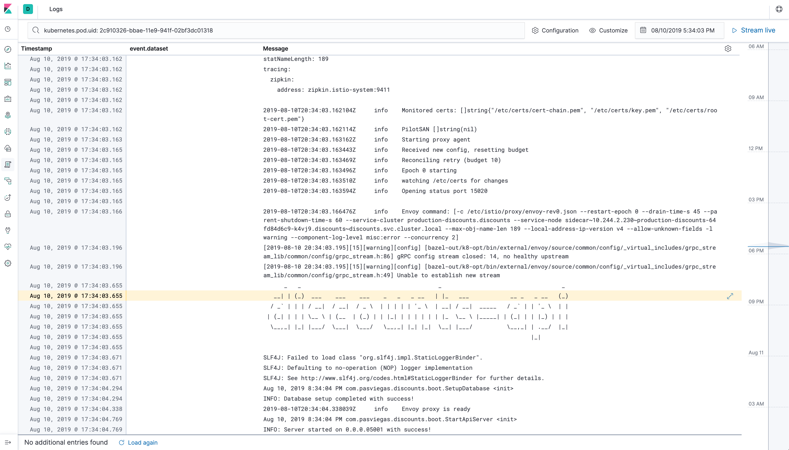

## Monitoring

* Using Elasticsearch and Kibana to store and visualize metrics

* As a DaemonSet to ensure that there’s a running instance on each node of the cluster. These instances are used to retrieve most metrics from the host, such as system metrics, Docker stats, and metrics from all the services running on top of Kubernetes.

#### Infraestructure Metrics - All hosts

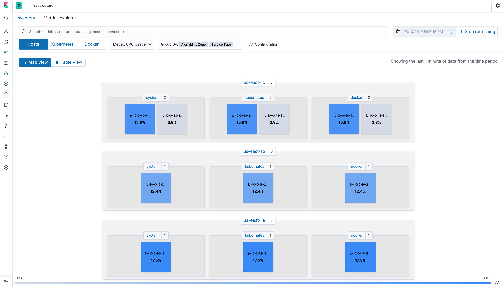

#### Infraestructure Metrics - Host Overview

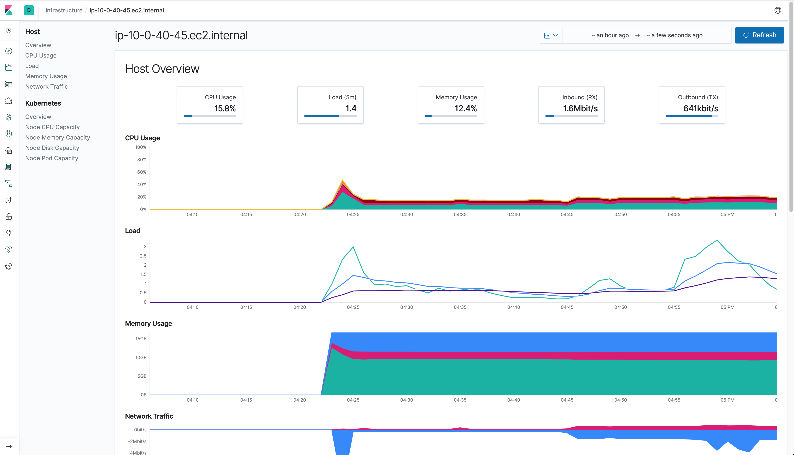

#### Dashboard Metrics - Host Overview

* 1

* 2
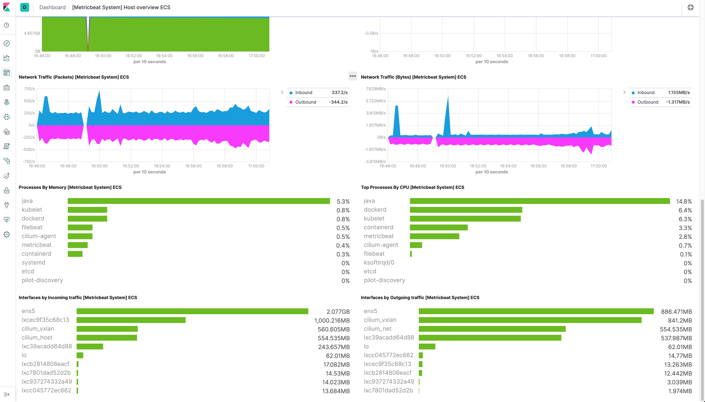

#### Infraestructure Metrics - Kubernetes

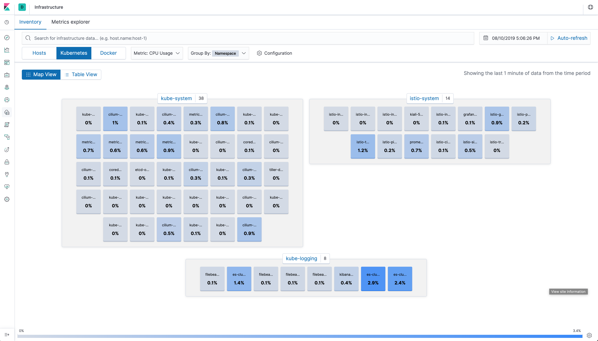

#### Infraestructure Metrics - Kubernetes Overview

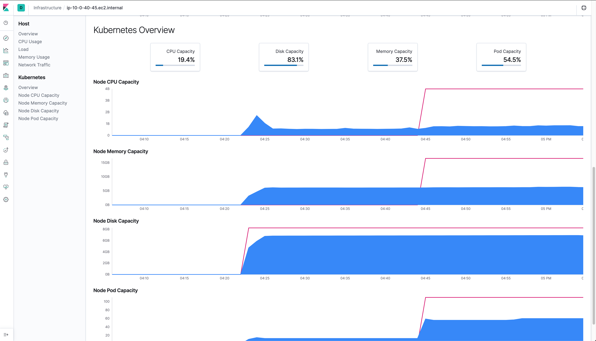

#### Infraestructure Metrics - Kubernetes Pod Overview

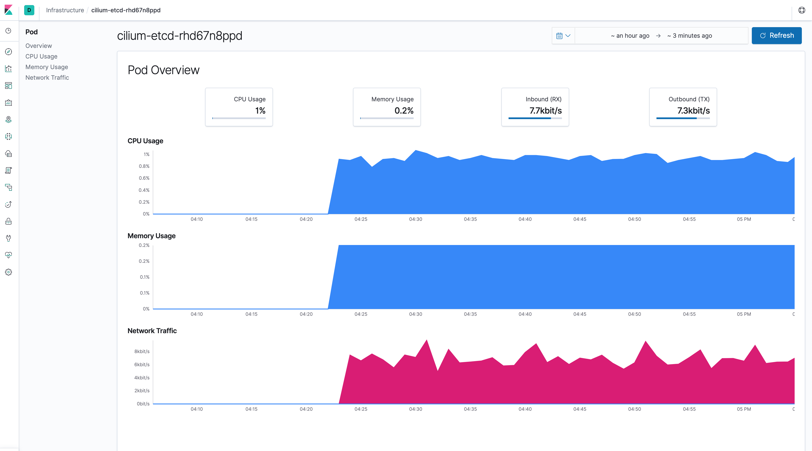

#### Dashboard Metrics - Kubernetes Overview

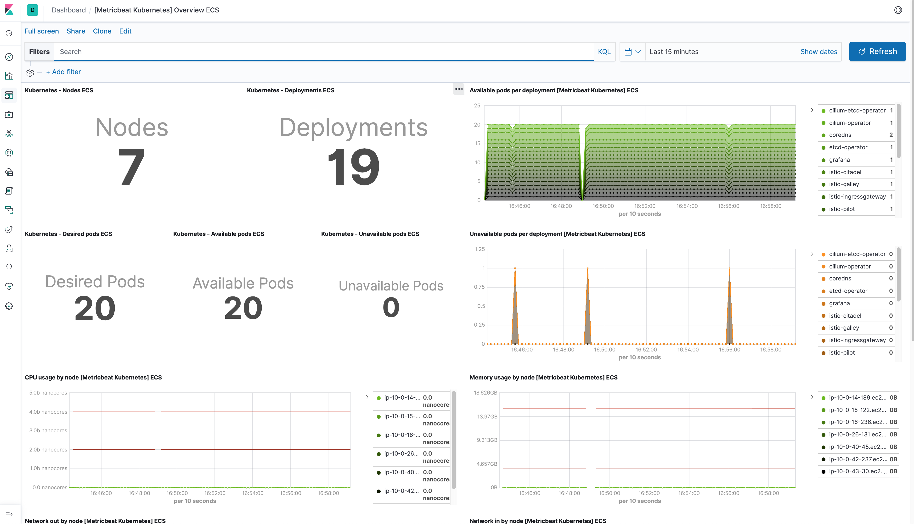

#### Dashboard Metrics - Pods Overview

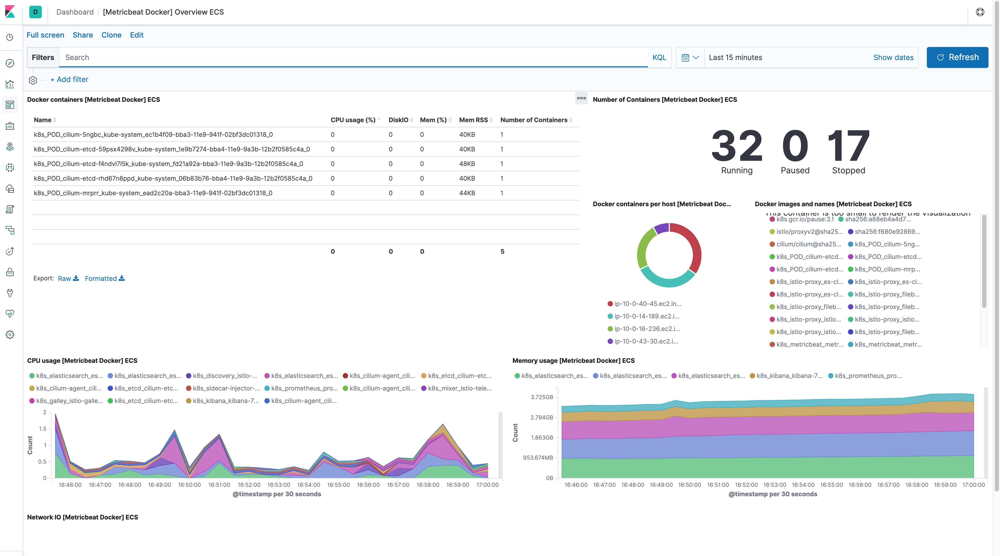

#### Grafana - Istio Performance

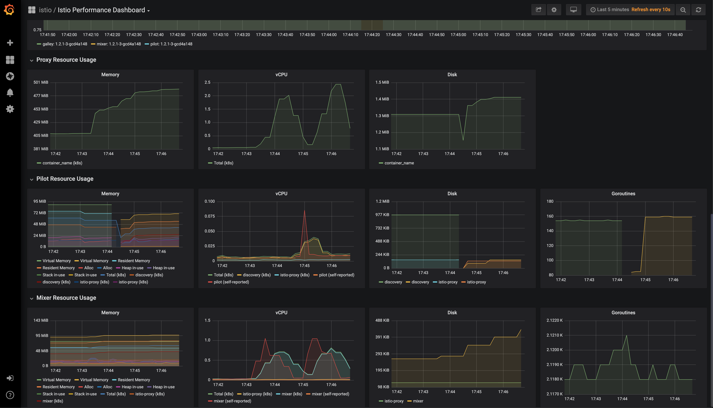

#### Jaeger - Trace

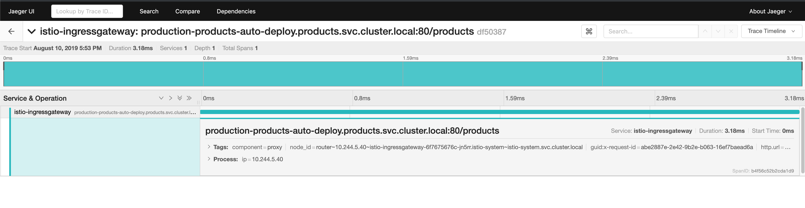

#### Kiali - Observability

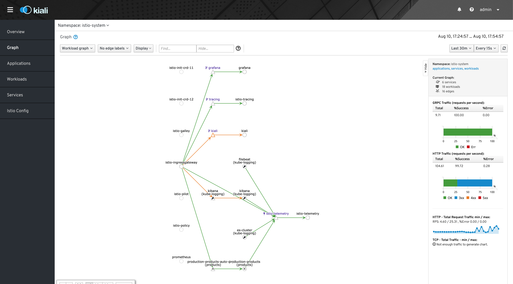


## Cloud Provider Solution Engineering

#### Packer - Imutable Infraestructure

* With packer you can generate an AMI with all operating system dependencies, scripts, files, mount paths etc.

* Once AMI is created, it will be used throughout the kubernetes cluster.

* Ensuring idempotency

* Kubernetes ami build process:

1. Install packages
2. Copy files and scripts
3. Mount Cilium BPF
4. Generate image

* There is also a build process for ETCD AMI

#### Terraform Modules (./infra/modules)

* Using Terraform modules to provide production-grade cloud infrastructure

* This repository includes 5 modules, which are:

1. Etcd
2. Instances
3. Kubernetes
4. Security_groups
5. VPC

#### Example of use

**Deploy 3 masters and 3 nodes with autoscaling group**

```hcl
...
module "k8s-cluster" {
  source                 = "../../modules/kubernetes"
  nodes                  = 3
  cluster_tag            = "${local.kube_cluster_tag}"
  iam_instance_profile   = "${aws_iam_instance_profile.aws_iam_instance_profile.name}"
  availability_zone      = ["${local.az_a}", "${local.az_b}", "${local.az_c}"]
  sg_id                  = "${element(module.security_group.security_group_id, 0)}"
  zone_id                = "${aws_route53_zone.k8s_private_zone.zone_id}"
  subnet_id              = "${module.vpc.private_subnets_id}"
  api_lb_subnets         = "${module.vpc.public_subnets_id}"
  api_lb_vpc_id          = "${element(module.vpc.vpc_id, 0)}"
 }
...
```

* All instances have user-data settings to run scripts that dynamically find configurations and join clusters.

#### VPC implemented following amazon's second best practice scenario 

* VPC CIDR 10.0.0.0/16
* Using 3 availability zones
* 3 Public Subnets
* 3 Private Subnets
* 3 Nat Gateways for private subnets
* 3 Elastic IPs for nats
* 1 Internet Gateway for public subnets
* 2 Route tables

#### Some considerations:

* SecurityGroups with only necessary rules

* IAM (policy, role, profile** for instances to communicate with aws services

* RDS for database

* Load Balancer for kubernetes api server

* Load Balancer for Istio Ingress

* AutoscalingGroup so kubernetes worker nodes can scale when they need

* Public access only for LBs

* SSM to store certificates

* ECR to store docker images

* Some dns records in Route53

* Bastion instance in Public Subnet with public ip

#### In short it would look like this:
`Missing a few things i quoted above`

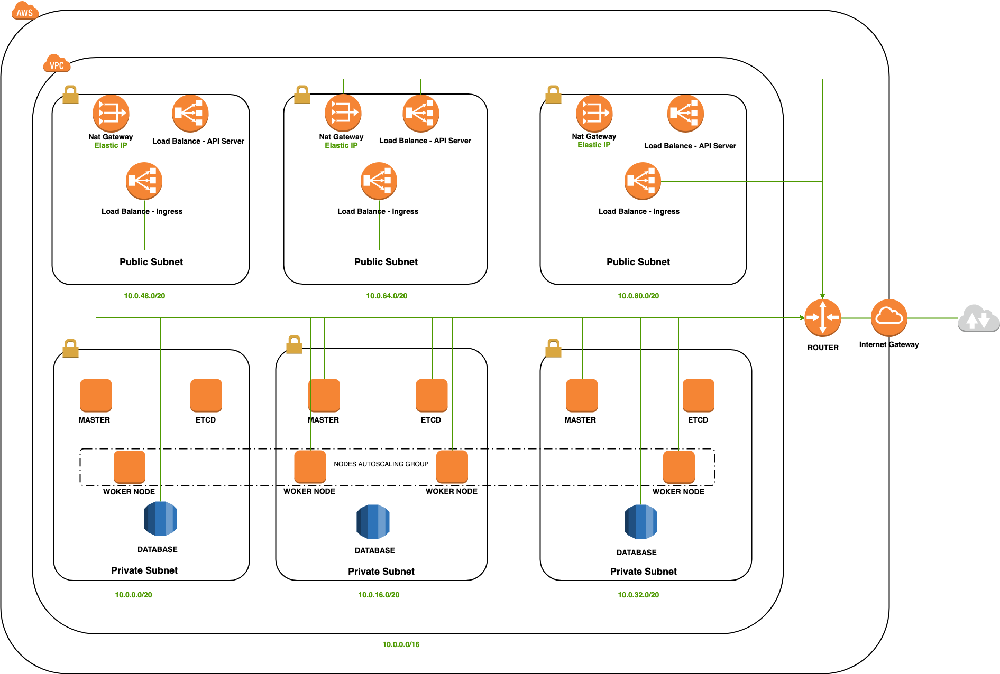

## Kubernetes admistration (the most focused)

#### Cluster with HA masters

* 3 Master nodes, each node in a different Availability zone

#### External cluster ETCD with HA
* 3 Etcd nodes in cluster

#### HA topology - External etcd
An HA cluster with external etcd is a topology where the distributed data storage cluster provided by etcd is external to the cluster formed by the nodes that run control plane components.

Like the stacked etcd topology, each control plane node in an external etcd topology runs an instance of the kube-apiserver, kube-scheduler, and kube-controller-manager. And the kube-apiserver is exposed to worker nodes using a load balancer. However, etcd members run on separate hosts, and each etcd host communicates with the kube-apiserver of each control plane node.

This topology decouples the control plane and etcd member. It therefore provides an HA setup where losing a control plane instance or an etcd member has less impact and does not affect the cluster redundancy as much as the stacked HA topology.

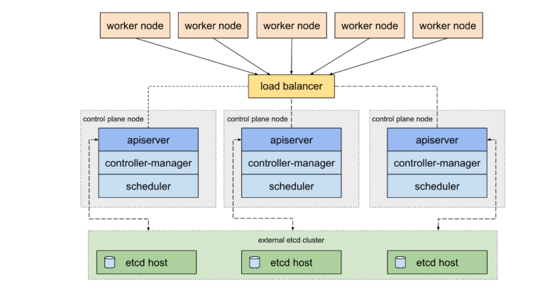

#### Cluster bootstrap with Kubeadm using manifest file

Kubeadm is a tool built to provide kubeadm init and kubeadm join as best-practice “fast paths” for creating Kubernetes cluster

`Example of manifest:`

```yaml
apiVersion: kubeadm.k8s.io/v1beta1
kind: ClusterConfiguration
kubernetesVersion: "v1.13.5"
apiServer:
  extraArgs:
    cloud-provider: aws
  certSANs:
  - "kubernetes.k8s.devopxlabs.com"
clusterName: lab
controlPlaneEndpoint: "kubernetes.k8s.devopxlabs.com"
controllerManager:
  extraArgs:
    cloud-provider: aws
    configure-cloud-routes: "false"
    address: 0.0.0.0
etcd:
    external:
        endpoints:
        - https://etcd-a.k8s.devopxlabs.com:2379
        - https://etcd-b.k8s.devopxlabs.com:2379
        - https://etcd-c.k8s.devopxlabs.com:2379
        caFile: /etc/kubernetes/pki/etcd/ca.crt
        certFile: /etc/kubernetes/pki/apiserver-etcd-client.crt
        keyFile: /etc/kubernetes/pki/apiserver-etcd-client.key
networking:
  dnsDomain: cluster.local
  podSubnet: 10.244.0.0/16
scheduler:
  extraArgs:
    address: 0.0.0.0

---
apiVersion: kubeadm.k8s.io/v1beta1
kind: InitConfiguration
nodeRegistration:
  kubeletExtraArgs:
    cloud-provider: aws

```
#### Using AWS SSM to store kubernetes and etcd certificates

* Stores pre-generated ETCD certificates

* Save bootstrap-generated kubernetes certificates

#### Extension cloud-provider-aws for a dynamic provision such as EBS, ELBs, EC2, etc.

* The AWS cloud provider provides the interface between a Kubernetes cluster and AWS service APIs. This project allows a Kubernetes cluster to provision, monitor and remove resources necessary for operation of the cluster.

#### Istio as Ingress and service mesh, with observability tools enabled

What is Istio?
Istio provides an easy way to create a network of deployed services with load balancing, service-to-service authentication, monitoring, and more, without requiring any changes in service code. You can add Istio support to services by deploying a special sidecar proxy throughout your environment that intercepts all network communication between microservices, configured and managed using Istio’s control plane functionality.


* Observability tools:
1. Grafana
2. Prometheus
3. Kiali
4. Jaeger

#### Cilium as CNI with Linux BPF enabled

What is Cilium?
Cilium is open source software for transparently providing and securing the network and API connectivity between application services deployed using Linux container management platforms like Kubernetes, Docker, and Mesos.

At the foundation of Cilium is a new Linux kernel technology called BPF, which enables the dynamic insertion of powerful security, visibility, and networking control logic within Linux itself. Besides providing traditional network level security, the flexibility of BPF enables security on API and process level to secure communication within a container or pod. Because BPF runs inside the Linux kernel, Cilium security policies can be applied and updated without any changes to the application code or container configuration.

* Efficient networking for Istio

The most basic form of collaboration is the Cilium CNI plugin providing networking to Istio by connecting all sidecar proxies together and by providing connectivity between proxies and the Istio control plane. Cilium also ensures that Istio managed services can communicate with pods that are not managed by Istio.

The following diagram illustrates how the Istio control plane, sidecar proxies, and the CNI plugin are layered on top of each other:

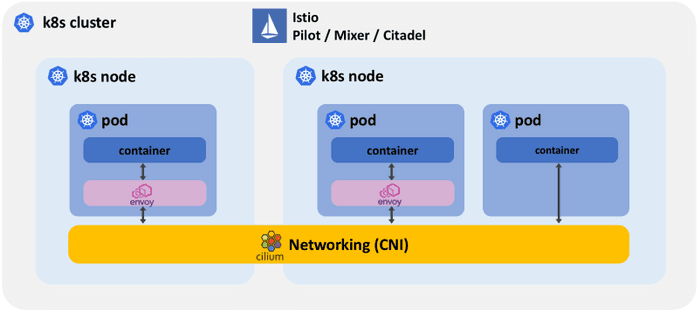

In this mode, all the Istio system components benefit from Cilium's efficient networking capabilities based on BPF in the Linux kernel. BPF is the replacement technology for networking and packet filtering such as iptables among other things. 

* Socket level redirection to accelerate Istio and Envoy

The service mesh architecture of Istio requires all network traffic for both incoming and outgoing requests of all pods participating in the service mesh to be redirected to the sidecar proxy. The sidecar proxy will terminate all TCP connections and perform services such as telemetry, retries, routing, mutual TLS, and authorization on behalf of the services and use a secondary so-called upstream TCP connection to reach the destination service. This is what allows a service mesh to perform mutual TLS on behalf of the application and is what achieves the transparency to not require changing any application code when running a service mesh.

However, this redirection can be costly when standard IP-based tooling such as iptables is used to implement the redirection as the entire TCP/IP stack has to be traversed multiple times.

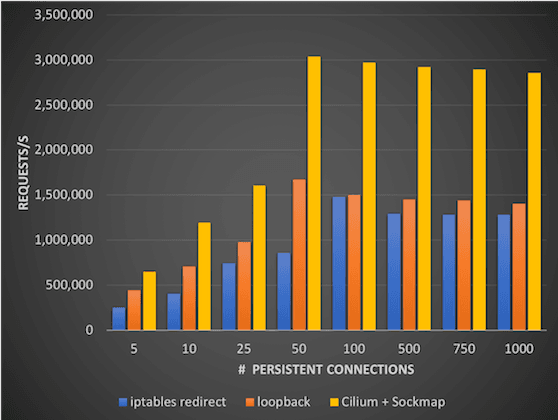

Cilium makes use of an exciting BPF feature called sockmap. It allows filtering and redirection and socket level and is thus making Cilium socket-aware. The socket is the interface that applications use to send and receive network traffic. Applied to Istio redirection requirements, this allows to essentially short-circuit TCP sockets on the same node and thus massively accelerate the TCP connection between the application and the sidecar proxy of the service mesh in a completely transparent manner. Neither the application nor the sidecar proxy require modification in any way.

#### Storage class for persistent state using aws-ebs provisioner
For dynamic provision, aws-ebs provide storage on-demand.

#### Helm for package manager
What is Helm?
Helm helps you manage Kubernetes applications — Helm Charts help you define, install, and upgrade even the most complex Kubernetes application.

For this scenario helm helps provide reliable deployments

Implementing:

1. Deployments

* With RollingUpdate strategy, maxUnavailable=0 (Zero downtime deployment)

2. Services
3. Ingress

* Using Istio Gateway and Virtual Service

All services including Elasticsearch, Kibana are running inside the K8s cluster.

#### In short, an app deployment would look something like this:

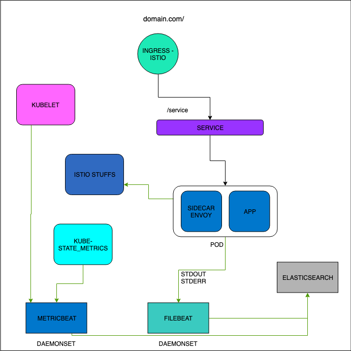

## Internal tools engineer

#### Makefile with all the steps and some helpers
#### Scripts to check local dependencies
#### With Terraform modules, can be a easily implemente a production grade infraestructue using a single declaration file importing the modules
#### Changing the Dockerfile apps base images and multi-stage build for a faster build and deploy


# Prerequisites

1. Linux/OSX system
2. AWS credentials
3. AWS cli (1.15)
4. packer
5. Terraform (11.9)
6. Helm (2.10)
7. kubectl
8. docker
9. docker-compose(OPTIONAL, only for local dev)
10. inspec(OPTIONAL, only for local tests and terraform modules)


#### All scripts were made using Makefile format, you can see in ./Makefile file all the options or follow the instructions below 

#### Verify if all dependencies is installed:

     $ make verify

#### Install missing dependencies:

1. AWS cli (1.15) [Info](https://docs.aws.amazon.com/cli/latest/userguide/install-linux.html)

For mac/osx:

     $ brew install awscli

For Linux:

     $ pip3 install awscli --upgrade --user

2. packer [Info](https://www.packer.io/downloads.html)

For mac/osx:

     $ brew install packer
    
For Linux:

     $ export VER="1.4.1"
     $ wget https://releases.hashicorp.com/packer/${VER}/packer_${VER}_linux_amd64.zip
     $ unzip packer_${VER}_linux_amd64.zip
     $ sudo mv packer /usr/local/bin

3. Terraform (11.9)[Info](https://learn.hashicorp.com/terraform/getting-started/install.html)

For mac/osx:

     $ brew install terraform

For Linux:

     $ sudo apt-get install unzip
     $ wget https://releases.hashicorp.com/terraform/0.11.9/terraform_0.11.9_linux_amd64.zip
     $ unzip terraform_0.11.9_linux_amd64.zip
     $ sudo mv terraform /usr/local/bin/terraform
     
4. Helm (2.10)[Info](https://github.com/helm/helm/releases/tag/v2.10.0)

For mac/osx:

     $ wget https://storage.googleapis.com/kubernetes-helm/helm-v2.10.0-darwin-amd64.tar.gz
     $ tar -zxvf helm-v2.10.0-darwin-amd64.tar.gz
     $ sudo mv darwin-amd64/helm /usr/local/bin/helm

For Linux:

     $ wget https://storage.googleapis.com/kubernetes-helm/helm-v2.10.0-linux-amd64.tar.gz
     $ tar -zxvf helm-v2.10.0-linux-amd64.tar.gz
     $ sudo mv linux-amd64/helm /usr/local/bin/helm

5. kubectl [Info](https://kubernetes.io/docs/tasks/tools/install-kubectl/)

For mac/osx:

     $ curl -LO https://storage.googleapis.com/kubernetes-release/release/$(curl -s https://storage.googleapis.com/kubernetes-release/release/stable.txt)/bin/darwin/amd64/kubectl
     $ chmod +x ./kubectl
     $ sudo mv ./kubectl /usr/local/bin/kubectl

For Linux:

     $ curl -LO https://storage.googleapis.com/kubernetes-release/release/$(curl -s https://storage.googleapis.com/kubernetes-release/release/stable.txt)/bin/linux/amd64/kubectl
     $ chmod +x ./kubectl
     $ sudo mv ./kubectl /usr/local/bin/kubectl

6. docker [Info](https://docs.docker.com/install/)

For mac/osx:

     See https://docs.docker.com/docker-for-mac/install/

For Linux:

     $ curl -fsSL https://get.docker.com -o get-docker.sh
     $ sh get-docker.sh

7. docker-compose(OPTIONAL, only for local dev)

For mac/osx:

     Not necessary (built-in with docker installation)
     
For Linux:

     $ sudo curl -L "https://github.com/docker/compose/releases/download/1.24.0/docker-compose-$(uname -s)-$(uname -m)" -o /usr/local/bin/docker-compose
     $ sudo chmod +x /usr/local/bin/docker-compose

# Usage

#### There are two ways to reproduce this whole scenario, using a single command, or step by step:

Single command:

    $ sudo make deploy/all 

Step-by-step:

AWS credentials, a region must be configured too:

    $ aws configure

Build ami with packer

    $ make infra/ami/build

Terraform init

    $ make infra/prod/init

Terraform apply

    $ make infra/prod/apply

Get kubeconfig, configure /etc/hosts and test kubernetes provision 

    $ sudo make test/api-server/connection
    
Build docker images and push

    $ make docker/build/push

Helm init

    $ make helm/init
    
Deploy a kubernetes job to create database schema

    $ make script/create/db
    
Configure namespaces for istio injection

    $ make istio/enable/injection
    
Deploy all the monitoring and logging services in kubernetes

    $ make logging/deploy 
    
Create index patterns in Elasticsearch

    $ make logging/create-pattern

Create dashboards in Kibana

    $ make logging/create-dashboards

Show Kibana URL

    $ make logging/url
    
Deploy discounts app

    $ make helm/deploy/discounts

Deploy products app

    $ make helm/deploy/products

Show products URL

    $ make products/url
    
That is all

For destroy use:

    $ make destroy/all

# Tips/troubles

For the first access in Kibana interface you need click in `Explore on my own`

For access istio telemetry services:

Get the default ingress url:
    
    $ make logging/url

And access:

1. Kiali: http://<IP ADDRESS OF CLUSTER INGRESS>:15029
2. Prometheus: http://<IP ADDRESS OF CLUSTER INGRESS>:15030
3. Grafana: http://<IP ADDRESS OF CLUSTER INGRESS>:15031
4. Jaeger: http://<IP ADDRESS OF CLUSTER INGRESS>:15032

* Using port for istio's limitation to serve these services exclusively, based on host header and as i don't have a registered domain we will use it this way.

* During development I used terraform's backend s3, this part is commented, to use just comment in ./infra/live/backend.tf

* If terraform destroy has a problem finishing, caused by some problem due to dynamic provisioning of resources in aws used by kubernetes (in some cases I caught this problem) 

run this:

    $ make ebs/delete
    $ make sg/delete
    $ make infra/prod/destroy

* To do remote access using the bastion host, use:

In `./infra/live/prod` directory

    $ ssh -A -o StrictHostKeyChecking=no -J ubuntu@$(terraform output bastion_ip) ubuntu@< REMOTE HOST >
